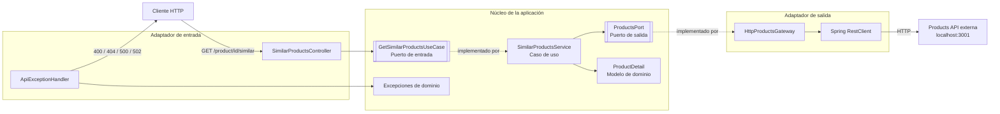
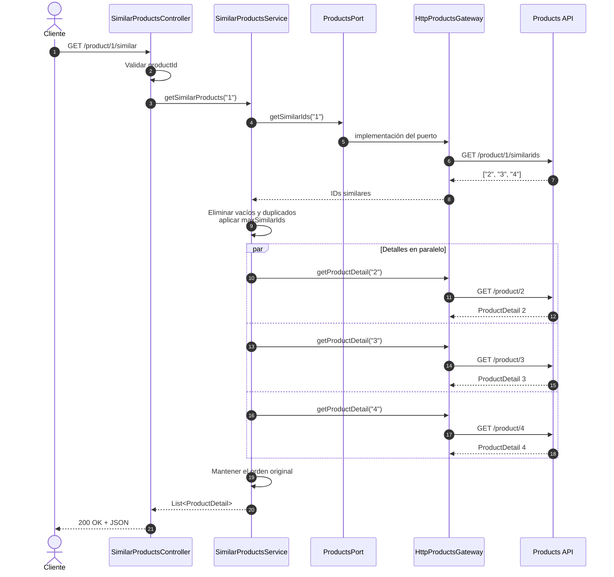
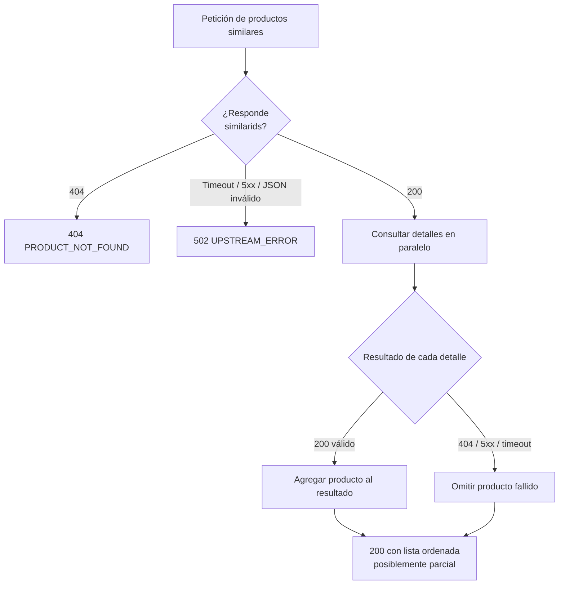
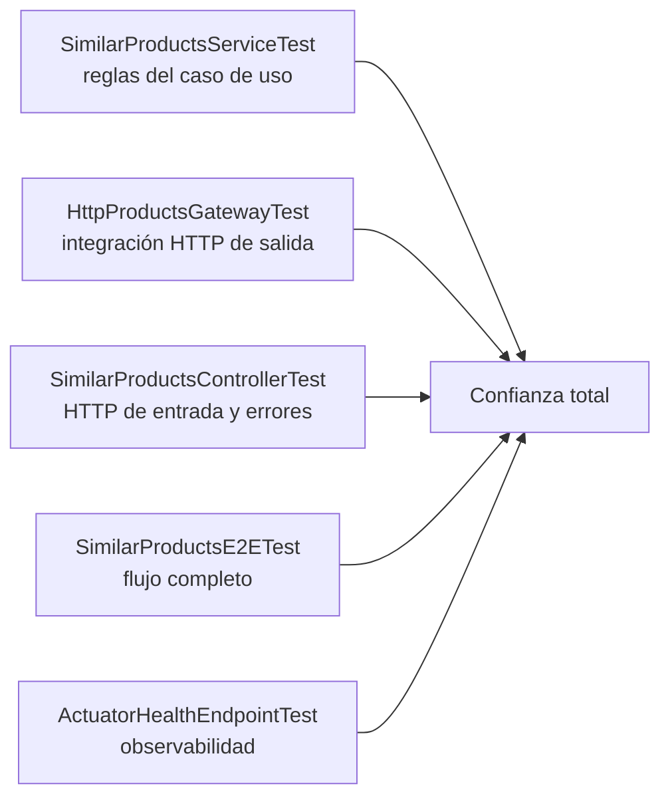

# Arquitectura y funcionamiento del backend

Este documento explica visualmente la arquitectura hexagonal y el recorrido completo de una petición a la API de productos similares.

## 1. Vista general de arquitectura hexagonal

La aplicación está dividida en un núcleo independiente y adaptadores externos. Las dependencias apuntan hacia los puertos del núcleo; el caso de uso no conoce Spring MVC, HTTP ni `RestClient`.



### Regla principal

```text
Adaptadores externos → Puertos del núcleo ← Servicios de aplicación
```

El servicio depende de `ProductsPort`, no de `HttpProductsGateway`. Por ello puede probarse con una implementación simulada y el adaptador HTTP puede sustituirse sin modificar el caso de uso.

## 2. Capas, clases y responsabilidades

```mermaid
classDiagram
    direction LR

    class GetSimilarProductsUseCase {
        <<input port>>
        +getSimilarProducts(productId) List~ProductDetail~
    }

    class SimilarProductsService {
        <<application service>>
        -ProductsPort productsGateway
        -Executor detailExecutor
        -long detailTimeoutMs
        -int maxSimilarIds
        +getSimilarProducts(productId) List~ProductDetail~
        -fetchDetailAsync(similarId) CompletableFuture
    }

    class ProductsPort {
        <<output port>>
        +getSimilarIds(productId) List~String~
        +getProductDetail(productId) Optional~ProductDetail~
    }

    class SimilarProductsController {
        <<input adapter>>
        -GetSimilarProductsUseCase getSimilarProducts
        +getSimilarProducts(productId) List~ProductDetail~
    }

    class HttpProductsGateway {
        <<output adapter>>
        -RestClient restClient
        -ObjectMapper objectMapper
        +getSimilarIds(productId) List~String~
        +getProductDetail(productId) Optional~ProductDetail~
    }

    class ProductDetail {
        <<domain model>>
        +String id
        +String name
        +BigDecimal price
        +boolean availability
    }

    class ApiExceptionHandler {
        <<input adapter>>
        +handleNotFound()
        +handleInvalidParameter()
        +handleUpstream()
        +handleUnexpected()
    }

    class SimilarProductsExecutorConfig {
        <<configuration>>
        +similarProductsExecutor() Executor
    }

    GetSimilarProductsUseCase <|.. SimilarProductsService : implements
    ProductsPort <|.. HttpProductsGateway : implements
    SimilarProductsController --> GetSimilarProductsUseCase : invokes
    SimilarProductsService --> ProductsPort : requires
    SimilarProductsService --> ProductDetail : produces
    HttpProductsGateway --> ProductDetail : maps
    SimilarProductsExecutorConfig --> SimilarProductsService : provides Executor
    ApiExceptionHandler ..> SimilarProductsController : handles errors from
```



| Zona | Clase | Responsabilidad |
|---|---|---|
| Dominio | `ProductDetail` | Representar un producto sin lógica HTTP |
| Dominio | Excepciones | Expresar errores relevantes para la aplicación |
| Puerto de entrada | `GetSimilarProductsUseCase` | Definir la operación ofrecida por el backend |
| Aplicación | `SimilarProductsService` | Orquestar IDs, concurrencia, orden, límites y respuestas parciales |
| Puerto de salida | `ProductsPort` | Definir qué necesita la aplicación de un proveedor de productos |
| Adaptador de entrada | `SimilarProductsController` | Validar la ruta y transformar HTTP en una llamada al caso de uso |
| Adaptador de entrada | `ApiExceptionHandler` | Convertir excepciones en respuestas JSON consistentes |
| Adaptador de salida | `HttpProductsGateway` | Consumir y traducir la API externa mediante `RestClient` |
| Configuración | `SimilarProductsExecutorConfig` | Crear el pool dedicado a consultas paralelas |

## 3. Flujo de una petición correcta



## 4. Respuesta parcial y tolerancia a fallos

Si falla el endpoint principal de IDs, la petición completa falla. Si falla únicamente el detalle de uno de los productos similares, ese elemento se omite y se conservan los demás.



## 5. Mapeo de errores HTTP

| Situación | Excepción | Respuesta |
|---|---|---|
| `productId` inválido | `ConstraintViolationException` | `400 INVALID_PARAMETER` |
| Producto origen inexistente | `ProductNotFoundException` | `404 PRODUCT_NOT_FOUND` |
| Fallo de la API externa principal | `UpstreamServiceException` | `502 UPSTREAM_ERROR` |
| Error inesperado | `Exception` | `500 INTERNAL_ERROR` |
| Fallo de un detalle individual | Se convierte en `Optional.empty()` | Se omite y continúa con `200` |

Todas las respuestas de error incluyen:

```json
{
  "timestamp": "2026-07-20T12:00:00Z",
  "status": 502,
  "code": "UPSTREAM_ERROR",
  "message": "Similar products service unavailable",
  "path": "/product/1/similar"
}
```

## 6. Relación con los tests



Los E2E recorren un servidor Spring real y un servidor externo simulado. Esto comprueba la integración completa sin depender de Docker ni de una API remota disponible.
